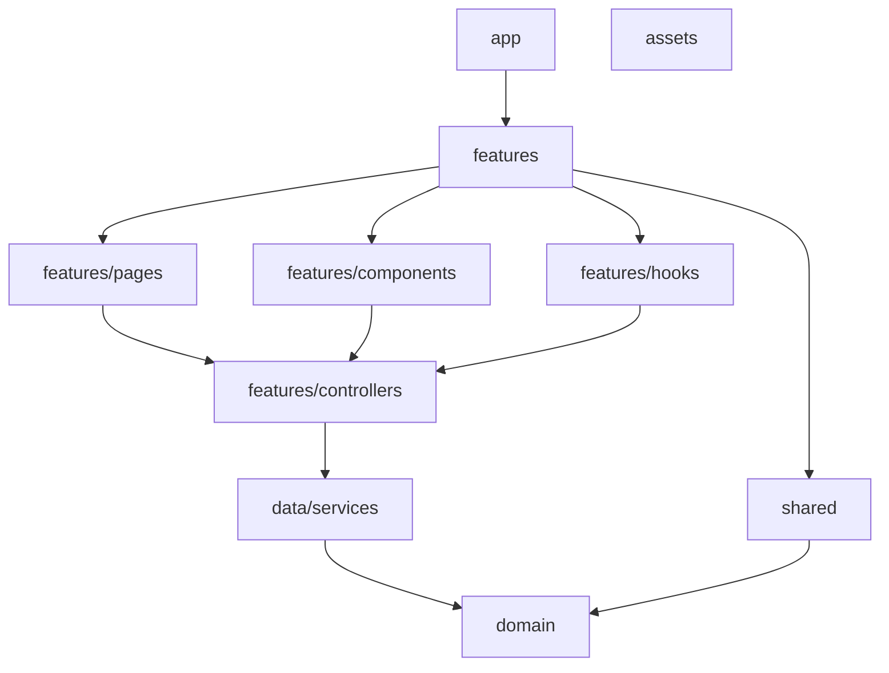

# TurneroFront (React + Vite)

Frontend en React + Vite, organizado por capas y features para escalar con reglas estrictas de importación.

## Requisitos
- Node.js 18+ (recomendado)

## Instalación rápida
1. Clonar el repositorio.
2. Instalar dependencias: npm install
3. Ejecutar: npm run dev

## Scripts principales
- npm run dev: entorno de desarrollo
- npm run build: build de producción
- npm run lint: validación ESLint (arquitectura + buenas prácticas)

## Arquitectura (resumen)
El proyecto está organizado por capas y features para separar responsabilidades:

- app: configuración global, router y providers.
- features: módulos funcionales (usuarios, roles, sectores, etc.).
	- pages: vistas (UI y orquestación)
	- components: UI específica del feature
	- hooks: lógica reutilizable del feature
	- controllers: acceso a datos (services) y coordinación de casos de uso
- shared: componentes/recursos reutilizables y configuración compartida.
- data: services de API (fetch/axios).
- domain: modelos y tipos del dominio.
- assets: recursos estáticos.

## Reglas de arquitectura (importaciones)
Se validan con ESLint (plugin boundaries):

- No hay imports cruzados entre features (solo dentro del mismo feature).
- Pages/Components/Hooks no importan services directamente.
- Controllers son el único punto de acceso a services.
- Shared no depende de features ni de data.

Estas reglas aseguran un proyecto modular, escalable y mantenible.

## Diagrama simple de capas

